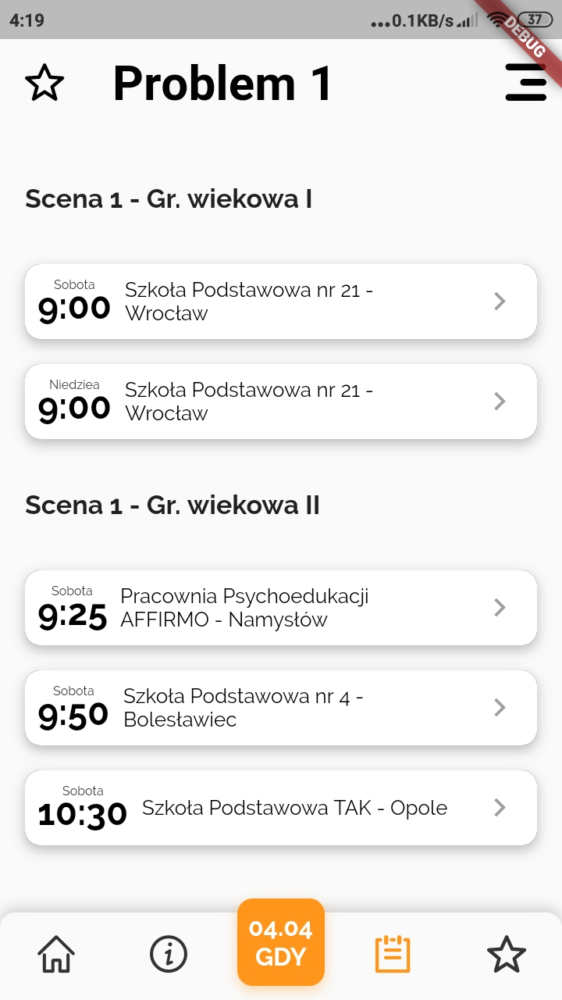

# ootm_app

This repository contains the first version of the app, which was a proof of concept. Further development was moved to a private repository, but a demo web build will be available shorty.

In the meantime, some screenshots:

---
## Schedule route

---
## City selection popup

---
## Favourites route

---
## Hidden menu
